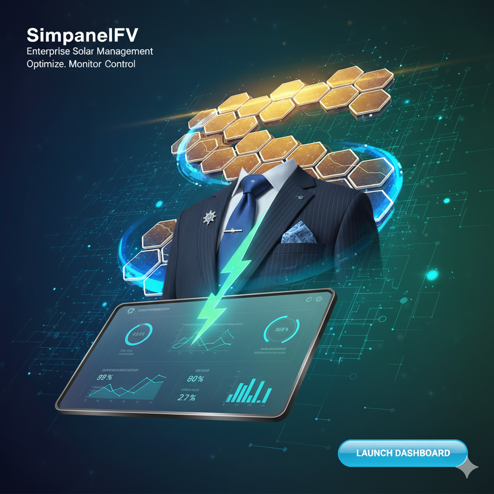

# simpanelfv
Este es un Proyecto Integrador de Introduccion a la programacion cientifica con MatLab y Python, ABP. 
Se basa en un Simulador Generador Fotovoltaico

## Tabla de contenidos
* [Memoria Descriptiva](#memoria-descriptiva)
* [Caracterísitcas de la App](#caracterísitcas-de-la-app)
    * [Interfaz gráfica](#interfaz-gráfica)
    * [Limitaciones](#limitaciones)
* [License](#license)
* [Autores](#Autores)

## Memoria Descriptiva

## Caracterísitcas de la App
Esta aplicación contiene las siguientes características:
- Configuración Personalizada: El usuario puede ingresar manualmente las especificaciones técnicas y características operativas del sistema generador que desea simular.
- 	Configuración Predefinida: Se ofrece la opción de utilizar un perfil predefinido, basado en los parámetros técnicos del generador perteneciente a la facultad
### Interfaz gráfica

### Limitaciones
La aplicación basará su enfoque al analisis físico-energtico y la facilidad de su uso, por lo cual  se excluyen las siguentes funcionalidades del proyecto.

- Ánalisis Economico: No realiza cálculos de viabilidad financiera, retorno de la inversión, costos de instalación o amortización, ya que  depended de variables externas (tarifas eléctricas, costos, impuestos) que son volátiles y escapan al alcance de este simulador.

- Dimensionamiento Automático: Simpanelfv es una herramienta de simulación y validación, no de diseño o dimensionamiento automático. La aplicación no sugiere una configuración óptima de paneles basada en un perfil de consumo.

- Análisis de Sombras y "Balance of System" (BOS): La simulación no contempla pérdidas de rendimiento ocasionadas por sombreado de objetos externos. Asimismo, el cálculo se centra en el rendimiento ideal del panel basado en la irradiancia y los datos del fabricante, sin simular las pérdidas específicas de componentes eléctricos del BOS.
## License
MIT License
Copyright (c) 2025 Simpanelfv

# Autores
- Francisco Moine: fmoine@frsf.utn.edu.ar
- Gonzalo Morel: gmorel@frsf.utn.edu.ar
- Leonel Oldrini: loldrini@frsf.ut.edu.ar

